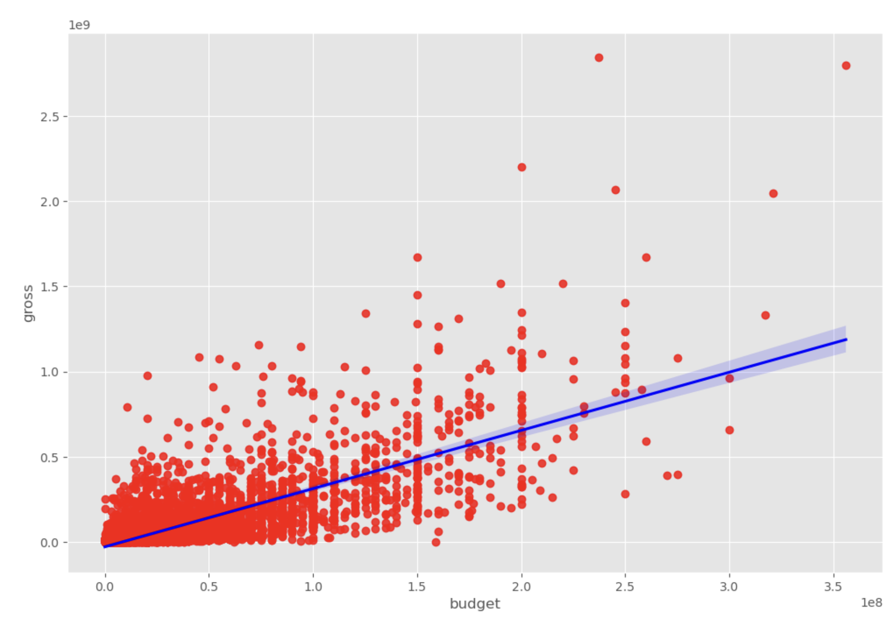
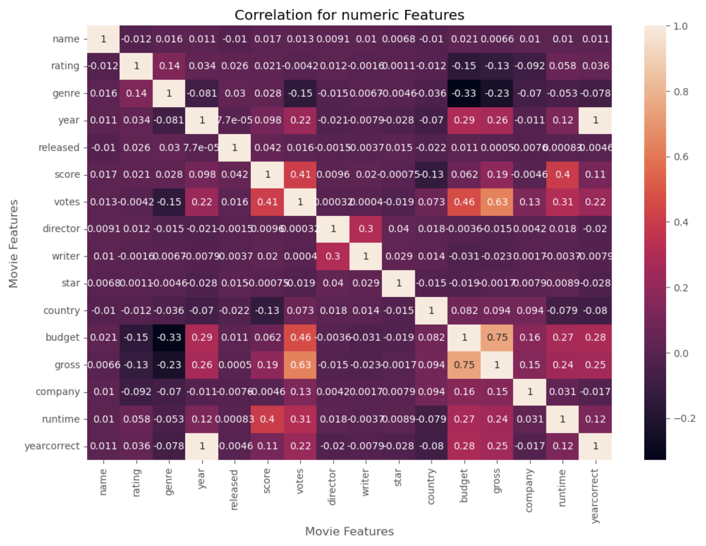

# 🎬 Movie Correlation Analysis with Python  

This project analyzes movie data to explore correlations between different features such as budget, gross earnings, scores, votes, runtime, etc. using **Python**, **Pandas**, and **Seaborn**.  

---

## 📌 Project Overview  
The goal of this project is to understand which factors most influence a movie’s box office performance.  
We answer questions like:  
- Do movies with bigger budgets make more money?  
- Is there a correlation between IMDb scores, votes, and gross earnings?  
- Which features are most strongly correlated?  

---

## 📂 Repository Contents  
- **`movie_correlation_python.ipynb`** → Main Jupyter Notebook with analysis and visualizations  
- **`README.md`** → Project documentation  

---

## 🛠️ Tools & Libraries Used  
- Python 3.x  
- Pandas  
- Numpy  
- Matplotlib  
- Seaborn  

---

## 📊 Analysis Performed  
- Data cleaning and handling of missing values  
- Extracting year from movie release dates (using regex and datetime)  
- Scatter plot analysis (Budget vs Gross Earnings)  
- Correlation analysis using Pearson’s method  
- Heatmap visualization of correlation matrix  

---
### 🔹 Budget vs Gross Earnings (with regression line)
This scatter plot shows the positive correlation between a movie's budget and its gross earnings.  

  

### 🔹 Correlation Heatmap for Numeric Features
This heatmap highlights which features are most strongly correlated.  
Budget and Gross Earnings show one of the strongest positive correlations.  

